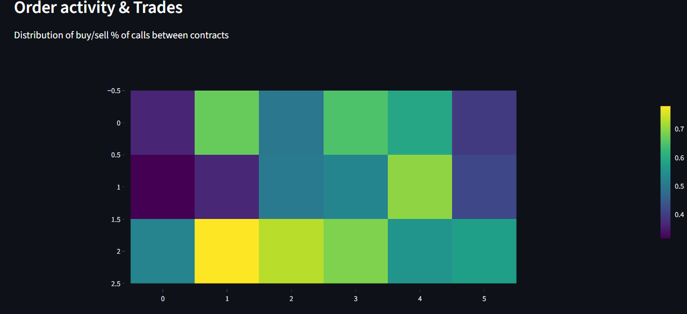

- 

- 

### Hawkes self-exciting process

We will use a variant of the standard Hawkes process formula described on the wiki.

\begin{equation}
\begin{aligned}
\lambda_i(t)=\mu+\alpha_M\cdot\text{log}(K/S)^2+\alpha_t\cdot\Delta t
+\sum_{T\in\text{Trades}}\text{exp}(\text{log}(w\cdot\text{Vol}))
\end{aligned}
\end{equation}

in which $\lambda_i(t)$ is the intensity of event (in this case, contract) $i$ at time $t$, and $\mu$ is the baseline intensity. The second term is the impact on being ITM or OTM and time decay, and the third iterates for all previous trades that occured for this contract by accounting for their volumes (higher volumes means more intensity). $\alpha_M$, $\alpha_t$ and $w$ are parameters.

We of course also have to account for overall time decay, thus we also multiply by a factor:

$\lambda_i(t+\Delta t)=\lambda_i(t)\cdot\text{exp}(\beta\cdot\Delta t)$

We then compute the total intensity (accross all contracts):

$\Lambda(t)=\sum_{i}\lambda_i(t)$

and then sample an amount of orders to generate by a Poisson process, with parameter $\Lambda(t)\cdot\text{dt}$. This is the so-called discrete version of a Hawkes process..

The clear difference with cross-excitation models is that here we don't account for impact of other contract's orders, which is a modelling choice that simplifies the simulation.

### Order volume

We use the formula

$\text{Vol}=\text{Lognormal}(\mu,\sigma)\cdot\text{VolumeBase}\cdot\text{exp}(-\gamma\text{log}(K/S)-\beta\Delta t)$

Here, $\mu$ and $\sigma$ determine the "randomness" of the order volume generation and the exponential factor determines the impact of moneyness and time decay, with $\beta$ being the time decay parameter, $\gamma$ the moneyness parameter, $\text{log}(K/S)$ the moneyness and $\Delta t$ the time till expiry in years.

### Buy and limit order probability distributions

For determining whether an order will be a buy or sell or a limit or not, we use a generalized linear model with the classic logistic function:

$p_{buy}=1/(1+\text{exp}(-\eta_{buy}))$

and similarly for the limit order probability.

We determine the coefficients $\eta_{buy}$ and $\eta_{limit}$ by using simple linear regression:

$\eta_{buy}=\beta_0+\beta_1\cdot\text{Imbalance}$

$\eta_{limit}=\alpha_0+\alpha_1\cdot\text{Volume}+\alpha_2\cdot\text{Imbalance}$

Here, the buy probability depends only on the base rate and the volume imbalance of the current orderbook (higher imbalance towards buy side promotes more buy orders), and the limit probatility depends on the base rate, volume imbalance (more imbalance means higher amount of limit orders), and the volume of the trade (higher volume means more likely to be a market order, since large trades tend to be market orders).

### Analysis

I've then built a simple Streamlit application to make graphs and such of all the data generated by the simulation.